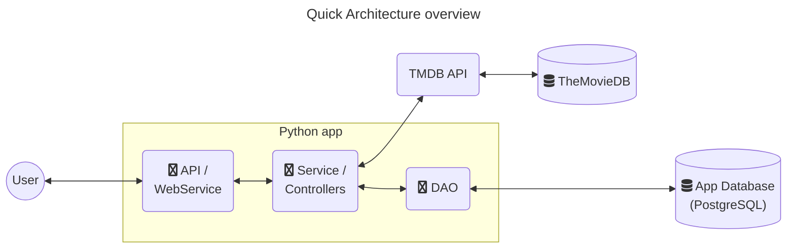

# Architecture 

```mermaid
---
title: Quick Architecture overview
---
    graph LR
    USR((User))
    DB[("fa:fa-database App Database \n (PostgreSQL)" )]
    API(fa:fa-python API / \n WebService)
    DAO(fa:fa-python DAO)
    SVC(fa:fa-python Service / \n Controllers )
    MDB[(fa:fa-database TheMovieDB)]
    MDBAPI(TMDB API)

    USR<--->API
        subgraph Python app 
            API<-->SVC<-->DAO
        end
    DAO<--->DB
    MDBAPI <--> MDB
    SVC <--> MDBAPI
```